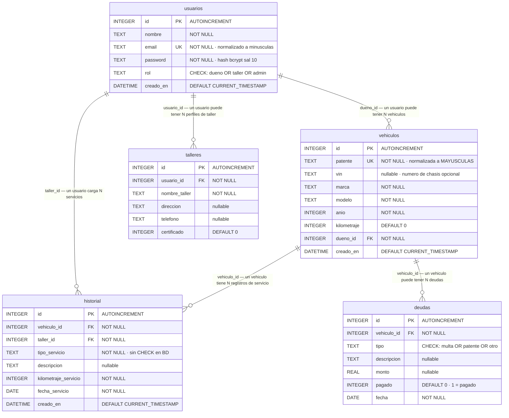

# Modelo de datos — HistoryCar

Universidad Champagnat · LDS 2026 · Grupo 8

Basado en el esquema real definido en [`database/schema.sql`](../database/schema.sql)
y en [`src/config/database.js`](../src/config/database.js).

---

## Diagrama Entidad-Relación (Mermaid)

---

## Descripción de tablas

### `usuarios`
Almacena todos los usuarios del sistema. El campo `email` se normaliza a minúsculas antes de guardarse, garantizando unicidad sin distinción de mayúsculas. La `password` se almacena como hash bcrypt (sal 10), nunca en texto plano. El `rol` está restringido por CHECK a los valores `dueno`, `taller` o `admin`.

### `vehiculos`
Registra los vehículos ingresados al sistema. La `patente` se normaliza a mayúsculas y es única. El campo `vin` (número de chasis) es opcional. `dueno_id` apunta al usuario propietario mediante FK a `usuarios.id`.

### `historial`
Registra los servicios realizados sobre un vehículo. `vehiculo_id` y `taller_id` son FKs obligatorias. El campo `tipo_servicio` **no tiene restricción CHECK en la base de datos** — los valores `service`, `reparacion`, `inspeccion` y `siniestro` son validados y seleccionados por el frontend. `descripcion` es opcional.

### `talleres`
Perfil extendido del usuario con rol taller. `usuario_id` apunta a `usuarios.id`. Sin restricción UNIQUE sobre `usuario_id`, por lo que un usuario puede tener múltiples registros de perfil de taller (relación 1:N). **Sin endpoints API activos en esta versión.**

### `deudas`
Prevista para registrar multas, patentes impagas u otras obligaciones vinculadas a un vehículo. `tipo` está restringido por CHECK a `multa`, `patente` u `otro`. `pagado` es un entero (0 = pendiente, 1 = pagado). `monto` es opcional (REAL nullable). **Sin endpoints API activos en esta versión.**

---

## Relaciones

| Relación | Cardinalidad | Columna FK |
|---|---|---|
| `usuarios` → `vehiculos` | 1:N | `vehiculos.dueno_id` |
| `usuarios` → `historial` | 1:N | `historial.taller_id` |
| `usuarios` → `talleres` | 1:N | `talleres.usuario_id` |
| `vehiculos` → `historial` | 1:N | `historial.vehiculo_id` |
| `vehiculos` → `deudas` | 1:N | `deudas.vehiculo_id` |

---

## Notas técnicas

- **Integridad referencial:** declarada mediante `FOREIGN KEY ... REFERENCES`, pero SQLite no la aplica por defecto a menos que se active `PRAGMA foreign_keys = ON`. El código actual no activa este PRAGMA.
- **tipo_servicio sin CHECK:** la restricción de valores válidos es responsabilidad exclusiva del frontend. A nivel SQL, cualquier texto es aceptable en esta columna.
- **talleres y deudas:** el esquema está definido y las tablas se crean al iniciar el servidor, pero no tienen controladores, modelos ni rutas activas en la versión actual.
